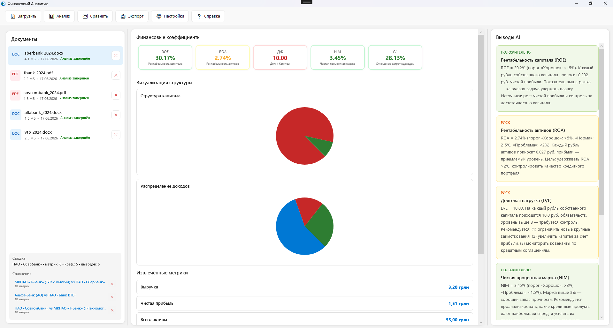

# Финансовый Аналитик

WPF-приложение для анализа финансовых отчётов (PDF, Word) через AI.



## Сборка и запуск

```
dotnet build
dotnet run
```

Требуется .NET 8 SDK, Windows.

## Как пользоваться

1. Загрузите PDF или Word документ
2. Нажмите «Анализ» — AI извлечёт показатели и рассчитает коэффициенты
3. Просмотрите метрики, графики и выводы
4. Экспортируйте отчёт (TXT, PDF, Word или Excel)

## Зависимости

- **LiveCharts2** — графики
- **iText7** — чтение PDF
- **FreeSpire.Doc** — чтение/создание Word
- **Entity Framework Core SQLite** — база данных
- **SkiaSharp** — создание PDF

## Настройка AI

Приложение работает с Ollama (локально) или любым OpenAI-совместимым API. Настройки — в меню «Настройки».
